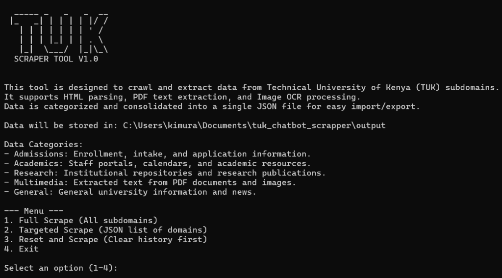

# Technical University of Kenya Chatbot Scraper



This is a modular and scalable web scraper designed to extract academic, administrative, and research data from TU-Kenya subdomains for use in RAG-based chatbot systems.

## Features

- Asynchronous crawling with aiohttp for high performance.
- Robust error handling for unreachable domains and timeouts.
- Consolidated JSON output: Generates a single, timestamped JSON file per run for easy portability.
- Persistent "already seen" tracking to avoid redundant scraping across different sessions.
- Multimedia processing (PDF extraction and Image OCR).
- Interactive CLI menu with ASCII art and detailed category descriptions.

## Installation

1. Ensure you have Python 3.10 or higher installed.
2. Clone the repository to your local machine.
3. Install the required dependencies:
   ```bash
   pip install -r requirements.txt
   ```
4. Ensure Tesseract OCR is installed on your system if you plan to process images.

## Configuration

- The list of target subdomains is located in: `context/tukenya.ac.ke subdomains.json`.
- Logs are stored in: `logs/scraper.log`.
- Scraped data is stored in the `output/` directory as consolidated JSON files.

## Usage

Run the main script to access the interactive menu:

```bash
python main.py
```

### Menu Options:

1. **Full Scrape**: Iterates through all subdomains defined in the configuration.
2. **Targeted Scrape**: Allows you to specify multiple domains to crawl. You must provide them as a JSON list (e.g., `["admission.tukenya.ac.ke", "research.tukenya.ac.ke"]`).
3. **Reset and Scrape**: Clears the scraping history (seen URLs) before starting a full crawl.
4. **Exit**: Closes the application.

### Data Categories:

- **Admissions**: Enrollment, intake, and application information.
- **Academics**: Staff portals, academic calendars, and resources.
- **Research**: Institutional repositories and research publications.
- **Multimedia**: Text extracted from PDF documents and processed images.
- **General**: Generic university information and news.

## Output Format

The script generates a consolidated JSON file for each run named `scraped_data_[mode]_[timestamp].json`. Each entry in the JSON file contains:
- `url`: The source URL.
- `content`: The cleaned text content.
- `category`: The inferred data category.
- `subdomain`: The source subdomain.
- `scraped_at`: ISO timestamp of when the data was collected.
- `selected_category`: The category selected during the run.

## Technical Details

- **Concurrency**: Managed via an asyncio semaphore (default: 10 concurrent requests).
- **Timeouts**: Individual requests have a 15-second timeout.
- **Persistence**: Successful scrapes are recorded in `output/seen_urls.json` to enable incremental updates.
